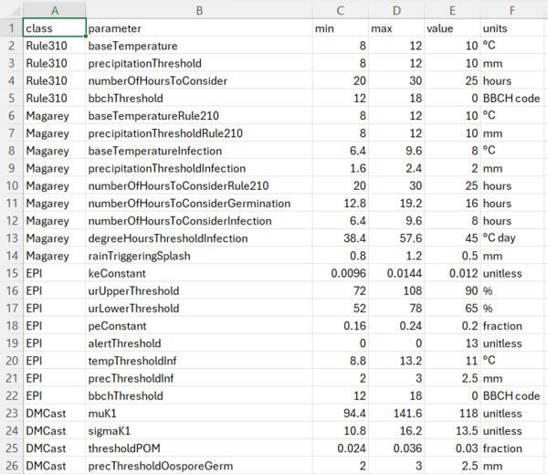

<div style="text-align: center;">
<pre>
                                                   _        ____
                                         ___   ___| |_ ___ |  _ \ _   _ ___
                                        / _ \ / __| __/ _ \| |_) | | | / __|
\(^^)/ °  ~ |_(°°)_| ~  ° _(--)_ °  ~  | (_) | (__| | |(_) |  __/| |_| \__ \ ~  ° ~(^^)~ °  ~ _(°°)_ °  ~  ~(**)~
((())) ~  °   (())   °  ~ |||||| ~  °   \___/ \___|\__\___/|_|    \__,_|___/ °  ~ ((())) ~  ° //()\\ ~  °  ((()))
</pre>
</div>


## The octoPus
The *octoPus* is the first digital organism, released as a console application, that assists users in predicting and interpreting grapevine downy mildew (*Plasmopora viticola*) primary infections. The source code of the *octoPus* is written in C# and is freely available for use through proper citation and licensing. This git repository contains the code and the instructions to smoothly run it.
The *octoPus* has two eyes, the grapevine phenology and susceptibility models, eight tentacles, representing eight *P. viticola* primary infection models, a brain, which is a Random Forest (RF) model, and a voice, a Large Language Model (LLM) that interprets the results of all the other organs and returns an user-supportive textual message. 

## Folder structure


The console application is structured in multiple folders, each containing either input files or classes and processes serving specific purposes. 
- The **Files** folder contains the input files that are needed to run the model: weather data and two parameter files.
	- The weather file(s) should be named like the following "*name-of-location.csv*" and can be either a daily or hourly weather series.
	- The first parameter file (hostSusceptibilityParameters.csv) is used to codify the BBCH phases of grapevine.
	- The second parameter file (octoPusParameters.csv) is needed to parameterize the eight primary infection models.
- The **LLM** folder contains the LLama LLM file and will have to be created by the user after cloning the repository.
- The **ModelCaller** folder contains the call to Llama, the pre-trained RF model, and the code to iterate through the weather data.
- **Models** stores the Datatype classes and the calls to the eight epidemiology and the phenology models (in the Models folder).
- **Readers** stores the pipelines to read the parametes, the .JSON configuration file, the console icon, and the entry point main method (Program.cs).

This document will guide users through the steps needed to successfully run *octoPus* on their machines. First, the [Required packages and extensions](#required-packages-and-extensions) needed to run the console app will be expained in detail. Then, the inputs required and their structure will be analysed together with the user customizations in [Inputs and customization](#inputs-and-customization).
This Git repository is a supplement to the scientific article "Releasing the *octoPus*, an open-source digital tool to promote Integrated Pest Management" (DOI: ), published on ............., in which the *octoPus* is introduced, calibrated, and tested in Italy. Another publication on SoftwareX "*octoPus*: an open-source software for supporting farmers in the control of grapevine downy mildew" (DOI: ) delves into the technical details of the console application. 

## Required packages and extensions
The *octoPus* works on Windows, Linux, and macOS operating systems and requires a series of programs, packages, and extensions to run.
* .NET core ≥ 7.0  
Please visit [this link](https://learn.microsoft.com/en-us/dotnet/core/install/upgrade) to download or update .NET core.
* R version ≥ R-4.3.2  
Please download the R version compatible to your operating system ([windows](https://cran.r-project.org/bin/windows/base/), [macOS](https://cloud.r-project.org/bin/macosx/), or [Linux](https://cran.r-project.org/)).
* Llama Large Language Model ≥ Meta-Llama-3  
Please visit [this link](https://huggingface.co/models?other=llama) to download the latest Llama version from [huggingface.co](https://huggingface.co/) or at [this link](https://llama.meta.com/llama-downloads) from the [Meta](https://ai.meta.com/meta-ai/) website. Once downloaded, create a folder called LLM as shown in [Folder structure](#folder-structure) and store the downloaded file in it.

The following dependencies and packages are used. The *octoPus* includes code lines to automatically download them if not pre isntalled in the system. Visit the links to find more information on each dependency or package used.
* .NET libraries:
  * LLamaSharp ([LINK](https://github.com/SciSharp/LLamaSharp.git) to documentation)
  * MathNet.Numerics ([LINK](https://numerics.mathdotnet.com/) to documentation)
  * R.NET ([LINK](https://rdotnet.github.io/rdotnet/) to documentation)
* R packages:
  * caret ([LINK](https://cran.r-project.org/web/packages/caret/index.html) to documentation)
  * randomForest ([LINK](https://cran.r-project.org/web/packages/randomForest/index.html) to documentation)
  * stats ([LINK](https://cran.r-project.org/web/packages/STAT/index.html) to documentation)

## Inputs and customization

### Climate data
The *octoPus* needs to be fed with weather series in .csv format to run. Weather data are stored by default in "octoPusAI/Files/Weather". It requires hourly or daily data for temperature (°C), precipitation (mm), relative humidity (%), and leaf wetness (%). An example of a hourly weather series for the Italian city of Bergamo is provided below. If daily data are used, hourly series are estimated from daily maximum and minimum temperatures.


Column [ 0 ] represent the site, columns [ 1 , 2 , 3 , 4 ] are the date and time, and columns [ 5 , 6 , 7 , 8 ] are respectively the hourly temperature (°C), precipitation (mm), radiation, relative humidity (%), and leaf wetness (0-1). Multiple weather files can be used to perform simultaneous analysis on different locations by simply dropping them in the dedicated folder but some steps are required in the [JSON configuration file](#json-configuration-file) to properly use them.
Once the climate data are in their dedicated folder, attention should be given to the host susceptibility parameterization.

### Host susceptibilty data
Host susceptibility data are stored by default in "octoPusAI/Files/parametersData/hostSusceptibilityParameters.csv". This .csv file is composed of two columns: BBCH [ 0 ] and susceptibility [ 1 ]. 


The file classifies the susceptibility of crucial grapevine BBCH phases (from budbreak, BBCH 11, to maturity, BBCH 89) in column [ 0 ] by assigning to them a score (column [ 1 ]) through a linear interpolation of expert-based opinions obtained from a survey circulated among Italian extension services (see [Bregaglio et al., 2022](https://doi.org/10.1016/j.jenvman.2022.115365)). BBCH phases and their susceptibility scores can be modified by the users. This done, the models can be parameterized according to specific use cases.

### Models parameterization
The models configuration is stored by default in "octoPusAI/Files/parametersData/octoPusParameters.csv". In this .csv file the parameters specific to each of the ten models (the eight primary infection models, the phenological model, and the susceptibility model) can be modified. The class column [ 0 ] contains the name of the model and column [ 1 ] is the specific parameter. These two columns **should not be modified**. Columns [ 2 , 3 , 4 ] represent respectively the minimum and the maximum values, and the actual value to be used in the simulation. Column [ 5 ] is the measurement unit of each specific parameter. 



For an exaustive description of each model routine and their parameters we refer to the Supplementary material S1 of Bregaglio et al., 2024 ___ADD DOI OF PREPRINT___.

### JSON configuration file
The JSON file can be found in "octoPusAI/Readers/octoPus.json" and it allows to fine-tune additional settings of the *octoPus*. The JSON file is divided in two classes: one used to define model settings and one to explicit filepaths. Below is reported the structure of the JSON file with example values and a brief explanation of each attribute.

<pre><code class = "language-json">
{
  "settings": {
    "startYear": 2003,          
    "endYear": 2021,            
    "sites": [ "Bergamo.csv" , "Chieti.csv" ], 
    "assistantRisk": 4,         
    "veryHighModelsThreshold": 4,
    "WeatherTimeStep": "daily"
  },
  "paths": {
    "weatherDir": "..\\..\\..\\files\\weather",                                                          
    "octoPusParametersPath": "..\\..\\..\\files\\parametersData\\octoPusParameters.csv",                 
    "susceptibilityFileBBCH": "..\\..\\..\\files\\parametersData\\hostSusceptibilityParameters.csv",     
    "outputDir": "..\\..\\..\\outputs\\",                                                                
    "LLMfile": "..\\..\\..\\LLM\\Meta-Llama-3-8B-Instruct-correct-pre-tokenizer-and-EOS-token-Q8_0.gguf",
    "Rversion" : "R-4.3.2"                                                                               
  }
}
</code></pre>

Inside the *settings* class, it should be inserted the "startYear" and "endYear" of the simulation, as int. The "sites" is a list that contains the filenames of the weather data files for which the model should run (**only** the files written in the square brackets, separated by a comma, will be used as weather input data and for each of them an output file will be produced). "assistantRisk" (is an int from 0 to 5, corresponding to very low, low, medium, high, and very high) defines the daily level of risk at which the LLM assistant is called in the routine and "veryHighModelsThreshold" (again as an int, from 0 to 8) is number of models that predict very high risk needed to classify that day as a one with very high risk of infection. The "WeatherTimeStep" property accepts strings that are either "daily" or "hourly" and should match the format of the weather data used.

The *paths* class explicitly defines the paths of input and output files. Noticeable are the two properties "LLMfile" and "Rversion". The first one defines the location and the name of the LLM file, which is **not** provided in this repository therefore should be created by the user before running the app (see section [Required packages and extensions](#required-packages-and-extensions) for the instructions on how to download Llama). "Rversion" is a string that specifies the R version currently installed on the machine and it is required to run the RF model.

### Launching the *octoPus*
After having completed this last step, the model is ready to be run with the specified user settings. Launch it and enjoy the *octoPus* at work!!


```
\(^^)/ °  ~ |_(°°)_| ~  ° _(--)_ °  ~  ~(^^)~ °  ~ _(°°)_ °  ~  ~(**)~ °  ~ \(^^)/ °  ~ |_(°°)_| ~  ° _(--)_ °  ~  ~(^^)~ °  ~ _(°°)_ °  ~  ~(**)~
((())) ~  °   (())   °  ~ |||||| ~  °  ((())) ~  ° //()\\ ~  °  ((())) ~  ° ((())) ~  °   (())   °  ~ |||||| ~  °  ((())) ~  ° //()\\ ~  °  ((()))
```

## Authors and acknowledgment
Show your appreciation to those who have contributed to the project.

## License
For open source projects, say how it is licensed.

## References
Bregaglio, S., Savian, F., Raparelli, E., Morelli, D., Epifani, R., Pietrangeli, F., Nigro, C., Bugiani, R., Pini, S., Culatti, P., Tognetti, D., Spanna, F.,   Gerardi, M., Delillo, I., Bajocco, S., Fanchini, D., Fila, G., Ginaldi, F., Manici, L.M., 2022. Journal of Environmental Management 317, 115365. https://doi.org/10.1016/j.jenvman.2022.115365 

