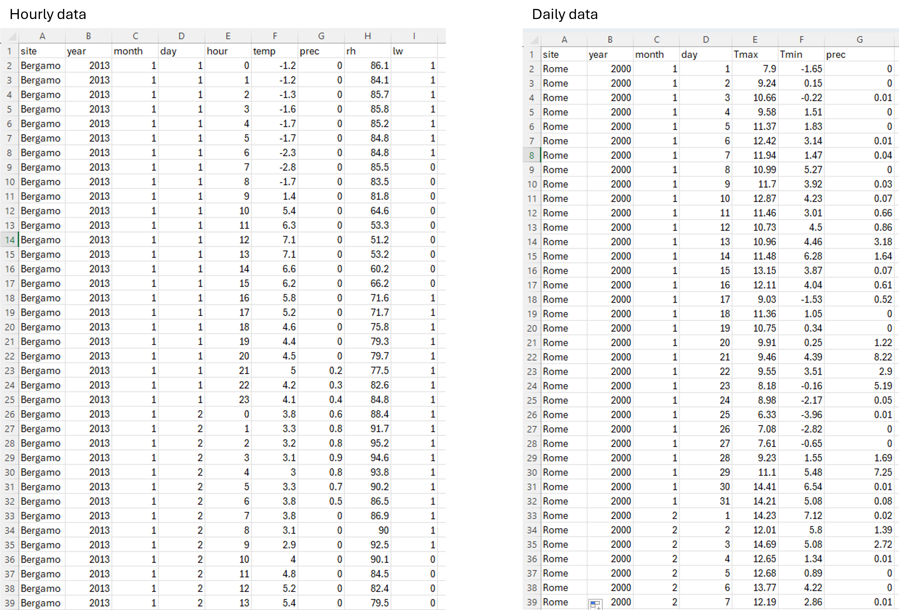

<div style="text-align: center;">
<pre>
                                                   _        ____
                                         ___   ___| |_ ___ |  _ \ _   _ ___
                                        / _ \ / __| __/ _ \| |_) | | | / __|
\(^^)/ °  ~ |_(°°)_| ~  ° _(--)_ °  ~  | (_) | (__| | |(_) |  __/| |_| \__ \ ~  ° ~(^^)~ °  ~ _(°°)_ °  ~  ~(**)~
((())) ~  °   (())   °  ~ |||||| ~  °   \___/ \___|\__\___/|_|    \__,_|___/ °  ~ ((())) ~  ° //()\\ ~  °  ((()))
</pre>
</div>

## The octoPus
The *octoPus* is the first digital organism, released as a console application, that assists users in predicting and interpreting grapevine downy mildew (*Plasmopora viticola*) primary infections. The source code of the *octoPus* is written in C# and is freely available for use through proper citation and licensing. This git repository contains the code and the instructions to smoothly run it.
The *octoPus* has two eyes, the grapevine phenology and susceptibility models, eight tentacles, represented by the primary infection models, a brain, which is a random forest model, and a voice, a large language model (LLM) that interprets the results of all the other organs and returns an user-supportive textual message. 


## Folder structure
The console application is structured in multiple folders, each containing either input files or classes and processes serving specific purposes. 
- The **Files** folder should contain the input files that are needed to run the model: weather data and two parameter files.
	- The weather file(s) should be named like the following: "name-of-the-location.csv"
	- The first parameter file (hostSusceptibilityParameters.csv) is used to define the BBCH phases of grapevine
	- The other parameter file (octoPusParameters.csv) is needed to parameterize the eight primary infection models.
- The **LLM** folder should contain the LLama large language model files and will have to be created by the user after cloning the repository.
- The **ModelCaller** folder contains the code fro the calls to Llama, the pre-trained Random Forest model, and the code to iterate through the weather data.
- **Models** stores the Datatype classes and the calls to both the eight epidemiology and the phenology models.
- **Readers** stores the pipelines to read input parametes, **octoPus.json** is the configuration file, **icon.ico** contains the console icon, and **Program.cs** is the entry point main method. 

This document will guide users thrpugh the steps needed to successfully run *octoPus* on their machines. First, the required packages and extensions needed to run the console app will be expained in detail in section [Required packages and extensions](#required-packages-and-extensions). Then, the inputs required and their structure will be analysed together with the user customizations in section [Inputs and customization](#inputs-and-customization).
This Git repository is a supplement to the scientific article "Freeing the *octoPus*, an open-source digital organism to promote Integrated Pest Management" (DOI: ), published on Agronomy for Sustainable Development, in which the *octoPus* is introduced, calibrated, and tested in Italy. Furthermore, another publication on SoftwareX "*octoPus*: an open-source software for supporting farmers in the control of grapevine downy mildew" (DOI: ) delves into the technical detaisl of the console application. 

## Required packages and extensions
The *octoPus* works on Windows, Linux, and macOS operating systems and requires a series of programs to properly run.
* .NET core ≥ 7.0  
Please visit [this link](https://learn.microsoft.com/en-us/dotnet/core/install/upgrade) to learn how to update the .NET core version
* R version ≥ R-4.3.2  
Please visit [this link](https://cran.r-project.org/bin/windows/base/) to download the latest R version (windows)  
Please visit [this link](https://cloud.r-project.org/bin/macosx/) to download the latest R version (macOS)
* Llama Large Language Model ≥ Meta-Llama-3  
Please visit [this link](https://huggingface.co/models?other=llama) to download the latest Llama version from [huggingface.co](https://huggingface.co/) or at [this link](https://llama.meta.com/llama-downloads) from the [Meta](https://ai.meta.com/meta-ai/) website. Once downloaded, create a folder called LLM as shown in [Folder structure](#folder-structure) and paste the downloaded file in it.

The following are the dependencies used. The script includes lines to automatically download the dependencies and packages if not pre isntalled in the system.
The following are the dependencies used. The app includes lines to automatically download the dependencies and packages if not pre isntalled in the system.
* .NET libraries:
  * LLamaSharp 
  * MathNet.Numerics
  * R.NET
* R packages:
  * caret
  * randomForest
  * stats

## Inputs and customization

### Climate data
The *octoPus* needs to be fed with weather series to run in .csv format. Weather data are stored by default in "octoPusAI/Files/Weather". It requires hourly data for temperature (°C), precipitation (mm), relative humidity (%), and leaf wetness (%). An example of a weather data for the Italian city of Bergamo is provided below.



Columns [ 0 ] represent the site, column [ 1 , 2 , 3 , 4 ] date and time, and columns [ 5 , 6 , 7 , 8 ] are respectively the hourly temperature (°C), precipitation (mm), radiation, relative humidity (%), and leaf wetness (0-1).
At the moment, in v1.0, only hourly data are supported in the console application but later releases will also include routines to estimate hourly data from daily maximum and minimum temperatures. Multiple weather files can be used to perform simultaneous analysis on different locations by simply dropping them in the dedicated folder but some steps are required in the [JSON configuration file](#json-configuration-file) to properly use them.
Once the climate data are in their dedicated folder, attention should be given to the host susceptibility parameterization.

### Host susceptibilty data
Host susceptibility data are stored by default in "octoPusAI/Files/parametersData/hostSusceptibilityParameters.csv". This .csv file is composed of two columns BBCH [ 0 ] and susceptibility [ 1 ]. 


It classifies the crucial grapevine BBCH phases (from budbreak, BBCH 11, to maturity, BBCH 89) in column [ 0 ] by assigning to them a score (column [ 1 ]) obtained through a linear interpolation of expert-based opinions obtained from a survey circulated among Italian extension services (Bregaglio et al., 2022). BBCH phases and their relative scores can be modified by the users. This done, the models can be parameterized according to specific use cases.

### Models parameterization
The models configuration is by default in "octoPusAI/Files/parametersData/octoPusParameters.csv". In this .csv file the parameters specific to each of the ten models (the eight primary infection models, the phenological model, and the susceptibility model) can be modified. The class column [ 0 ] contains the name of the model (it should not be modified), [ 1 ] is the specific parameter, columns [ 2 , 3 , 4 ] represent respectively the minimum and the maximum values, and the actual value to be used in the simulation, and column [ 5 ] is the measurement unit of each specific parameter. 


For an exaustive description of each model routine and their parameters we refer to the Supplementary material S1 of the scientific punlication this repository supplements --CITATION (Bregaglio et al., 2024)--.

### JSON configuration file
The JSON file can be found in "octoPusAI/octoPus.json". This file allows to finetune the settings of the *octoPus*. The JSON file is divided in two classes: one used to define additional model settings and one to explicit filepaths. Below is reported the structure of the JSON file with example values and a brief explanation of each attribute.

<pre><code class = "language-json">
{
  "settings": {
    "startYear": 2003,          
    "endYear": 2021,            
    "sites": [ "Bergamo.csv" , "Chieti.csv" ], 
    "assistantRisk": 4,         
    "veryHighModelsThreshold": 4
  },
  "paths": {
    "weatherDir": "..\\..\\..\\files\\weather",                                                          
    "octoPusParametersPath": "..\\..\\..\\files\\parametersData\\octoPusParameters.csv",                 
    "susceptibilityFileBBCH": "..\\..\\..\\files\\parametersData\\hostSusceptibilityParameters.csv",     
    "outputDir": "..\\..\\..\\outputs\\",                                                                
    "LLMfile": "..\\..\\..\\LLM\\Meta-Llama-3-8B-Instruct-correct-pre-tokenizer-and-EOS-token-Q8_0.gguf",
    "Rversion" : "R-4.3.2"                                                                               
  }
}
</code></pre>

Inside the setting class, it should be inserted the "startYear" and "endYear" of the simulation, as int; the "sites" is a list that contains the filenames for which the model should run (**only** the files written in the square brackets, separated by a comma, will be used as weather input data and for each of them an output file will be produced); the daily level of risk (is an int and levels go from 0 to 5, corresponding to very low, low, medium, high, and very high) at which the LLM assistant is called in the routine ("assistantRisk"); and the int number of models to predict very high risk for classifying that day as a day with very high risk of infection ("veryHighModelsThreshold").

The paths class explicitly defines the paths of input and output files. Noticeable are the two properties "LLMfile" and "Rversion". The first one defines the location and the name of the LLM file, which is not provided in this repository therefore should be set by the user before running the app (see section [Required packages and extensions](#required-packages-and-extensions) for the instructions on how to download Llama). "Rversion" is a string that specifies the R version currently installed on the machine that uses the app. It is required to run the random forest model.

### Launching the *octoPus*
After having completed this last step, the model is ready to be run with the specified user settings. Launch it and enjoy the *octoPus* at work!!


```
\(^^)/ °  ~ |_(°°)_| ~  ° _(--)_ °  ~  ~(^^)~ °  ~ _(°°)_ °  ~  ~(**)~ °  ~ \(^^)/ °  ~ |_(°°)_| ~  ° _(--)_ °  ~  ~(^^)~ °  ~ _(°°)_ °  ~  ~(**)~
((())) ~  °   (())   °  ~ |||||| ~  °  ((())) ~  ° //()\\ ~  °  ((())) ~  ° ((())) ~  °   (())   °  ~ |||||| ~  °  ((())) ~  ° //()\\ ~  °  ((()))
```

## Authors and acknowledgment
Show your appreciation to those who have contributed to the project.

## License
For open source projects, say how it is licensed.

## References
Bregaglio, S., Savian, F., Raparelli, E., Morelli, D., Epifani, R., Pietrangeli, F., Nigro, C., Bugiani, R., Pini, S., Culatti, P., Tognetti, D., Spanna, F.,   Gerardi, M., Delillo, I., Bajocco, S., Fanchini, D., Fila, G., Ginaldi, F., Manici, L.M., 2022a. Journal of Environmental Management 317, 115365. https://doi.org/10.1016/j.jenvman.2022.115365 

